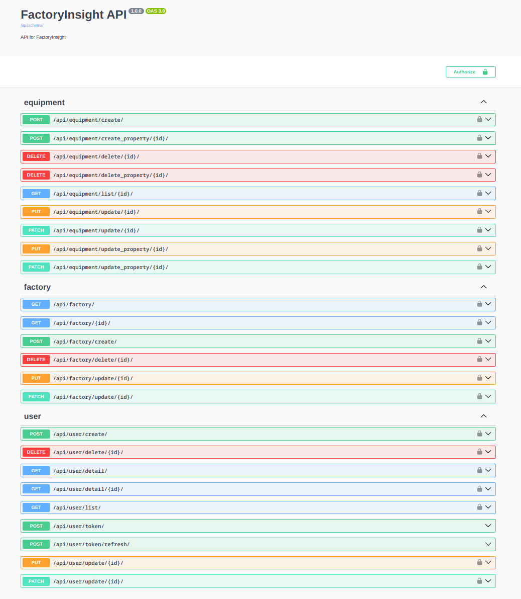
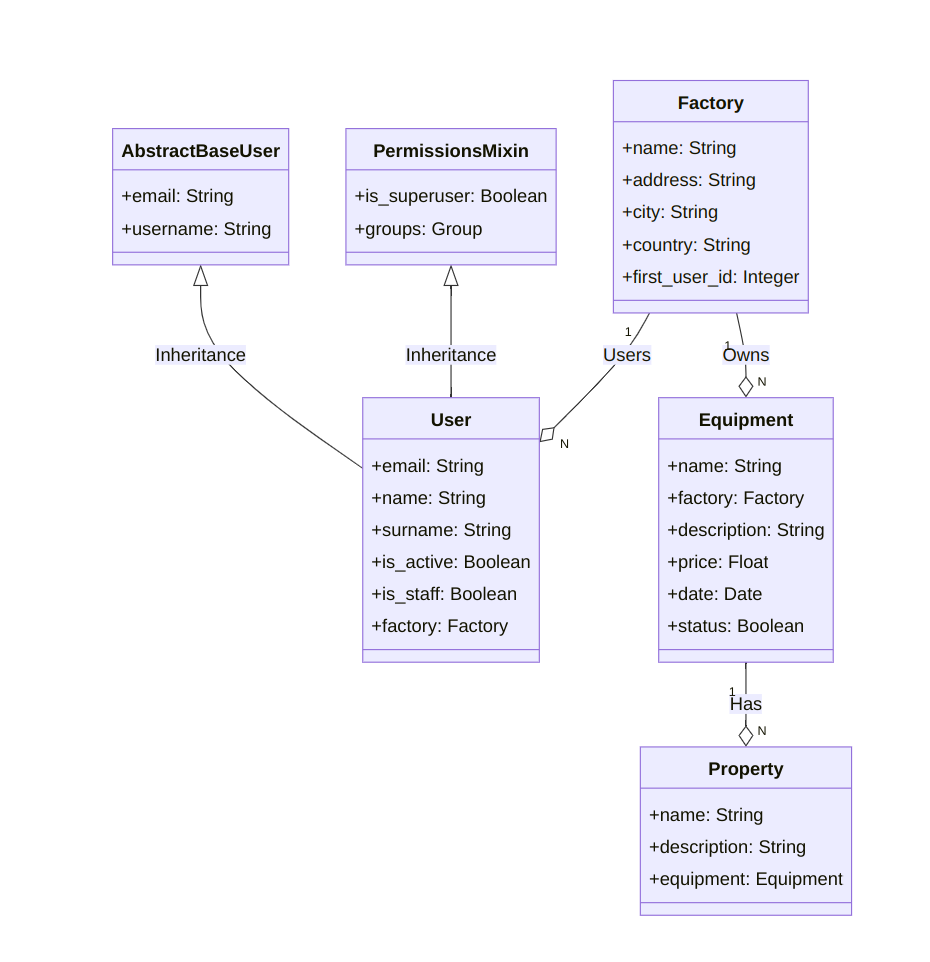

# FactoryInsights API

## Proje Tanımı
FactoryInsights, kullanıcıların hesap oluşturmasına, fabrikalar eklemesine, bu fabrikalardaki makineleri yönetmesine ve her bir makineye özellik eklemesine izin veren Django ile gelisitirilmis bir web uygulamasıdır.

## API Dokümantasyonu

[Swagger Docs](http://104.248.140.14/api/schema/swagger-ui/)



## Model Tasarımı




## Genel Gereksinimler

### 1. Kullanıcı Yönetimi
- Admin ve Fabrika Kullanıcı rolleri bulunmaktadır.
- Admin, tüm fabrikaları ve makineleri görebilirken, Fabrika Kullanıcı yalnızca kendi fabrikasına ait bilgileri görebilir ve bu fabrikaya ait makineleri listeleyebilir.
- Admin, yeni bir fabrika oluştururken bu fabrikaya bir varsayılan kullanıcı oluşturmak zorundadır.
- Kullanıcılara, rollerinden bağımsız olarak kimlik doğrulama için bir JWT Erişim belirteci olmalıdır.
- Giriş yapmış kullanıcılar, fabrikaları ve bu fabrikalara ait makineleri görüntüleyebilmeli ve yönetebilmelidir.

### 2. Fabrika Yönetimi
- Fabrika kullanıcıları, fabrika bilgilerini güncelleyebilmeli ve yeni makineler ekleyebilmelidir.
- Fabrikaların temel bilgileri kaydedilmelidir.

### 3. Makine Yönetimi
- Her kullanıcı kendi fabrikasına makine ekleyebilir.
- Makinelerin temel bilgileri kaydedilmelidir.
- Kullanıcılar, her bir makine için özellikler ekleyebilmelidir.

### 4. Özellik Tanımlama
- Kullanıcılar, her bir makine için özellikler tanımlayabilmelidir (örneğin, kapasite, enerji tüketimi).

## Nasıl Çalıştırılır
Aşağıdaki komutlar ile proje çalıştırılabilir. Server başlatıldıktan sonra http://localhost:8000 adresinden erişilebilir. 
```bash 
python -m venv venv # Virtual Environment oluşturulur.
source venv/bin/activate # Virtual Environment aktif edilir.
pip install -r requirements.txt # Gerekli paketler yüklenir.
python manage.py makemigrations # Veritabanı tabloları oluşturulur.
python manage.py migrate # Veritabanı oluşturulur.
python manage.py createsuperuser # Admin kullanıcısı oluşturulur.
python manage.py runserver # Server başlatılır.

```

## Test
TODO: Projedeki butun test senaryolarini ekle.

### User Modeli Test Senaryolari
- Create User: Input email and password, verify successful creation.
- Email Normalization: Input email with uppercase letters, verify lowercase normalization.
- Invalid Email: Input None for email, verify ValueError is raised.
- Create Superuser: Input email and password, verify superuser and staff privileges.

### Testlerin Çalıştırılması

```bash
coverage run --omit='*/migrations/*','*/__init__.py','*/apps.py','*/admin.py','*/tests.py','*/urls.py','*/wsgi.py' manage.py test
```

### Test Coverage
| Name                     | Stmts | Miss | Cover |
|--------------------------|-------|------|-------|
| app/settings.py          |   24  |   0  |  100% |
| core/models.py           |   50  |   3  |   94% |
| equipment/serializers.py |   17  |   0  |  100% |
| equipment/views.py       |   55  |   1  |   98% |
| factory/serializers.py   |   32  |   0  |  100% |
| factory/views.py         |   43  |   0  |  100% |
| manage.py                |   12  |   2  |   83% |
| user/serializers.py      |   16  |   6  |   62% |
| user/views.py            |   36  |   0  |  100% |
| TOTAL                    |  285  |  12  |   96% |


